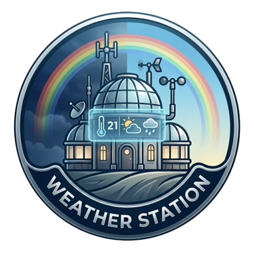

<div align="center">



# WX Station

### ESP32 Weather Station · Firebase · Flutter

[](https://flutter.dev)
[](https://dart.dev)
[](https://firebase.google.com)
[](https://www.espressif.com)
[](LICENSE)

A professional, real-time weather monitoring system pairing an **ESP32 hardware sensor node** with a **Flutter mobile dashboard**. Sensor data is streamed live to Firebase Realtime Database, compared against open-source internet weather, and displayed in a sleek dark-themed UI.

</div>

---

## ✨ Features

| Category | Details |
|---|---|
| 📡 **Live Sensor Data** | Temperature, Humidity, Pressure, Wind Speed streamed every second |
| 🔥 **Firebase Realtime DB** | Live path `/weather_station` + historical log `/weather_history` (last 48 readings) |
| 📶 **ESP-NOW Protocol** | Wireless data relay from external sensor ESP32 to display ESP32 (no router hop) |
| 🌐 **Internet Weather** | Open-Meteo API (free, no key) fetched by GPS location for side-by-side comparison |
| 📊 **Analytics Panel** | 48-point history charts with fl_chart, sensor vs internet bar comparison |
| 📍 **Auto Location** | Geolocator + Geocoding resolves city name and fetches local forecast |
| 🎨 **Dark Sci-Fi Theme** | Orbitron + Share Tech Mono fonts, color palette mirroring the TFT display |
| ⚡ **Performance** | `Selector`-based state, `RepaintBoundary` on heavy widgets, `const` constructors |

---

## 🏗️ System Architecture

```
┌─────────────────────────────────┐       ┌──────────────────────────┐
│        External ESP32           │       │      Flutter App         │
│  ┌────────┐  ┌───────┐          │       │  ┌───────────────────┐   │
│  │ DHT11  │  │BMP280 │  Wind    │       │  │  Dashboard Screen │   │
│  │(Temp/  │  │(Pres) │  Pulse   │       │  │  ┌─────────────┐  │   │
│  │  Hum)  │  │       │  Counter │       │  │  │  Hero Panel │  │   │
│  └───┬────┘  └───┬───┘    │     │       │  │  │ Sensor Cards│  │   │
│      └───────────┴────────┘     │       │  │  │  Analytics  │  │   │
│             ESP32 Core          │       │  │  └─────────────┘  │   │
│       ┌─────────┴──────────┐    │       │  └────────┬──────────┘   │
│       │  ESP-NOW Broadcast │────┼──────▶│           │              │
│       │  Firebase Push     │────┼──┐    │  Provider / AppState     │
│       └────────────────────┘    │  │    └───────────┬──────────────┘
└─────────────────────────────────┘  │                │
                                     │    ┌───────────▼──────────────┐
                                     └───▶│  Firebase Realtime DB    │
                                          │  /weather_station (live) │
                                          │  /weather_history (log)  │
                                          └──────────────────────────┘
```

---

## 📁 Project Structure

```
wx_station_v4/
├── lib/
│   ├── main.dart                       # App entry point, Firebase init
│   ├── models/
│   │   └── weather_data.dart           # WeatherData model + labels
│   ├── screens/
│   │   └── dashboard_screen.dart       # Main UI screen
│   ├── services/
│   │   ├── app_state.dart              # Provider state management
│   │   ├── app_theme.dart              # Dark theme + color palette
│   │   ├── firebase_service.dart       # Live & history streams
│   │   └── location_weather_service.dart # GPS + Open-Meteo fetch
│   └── widgets/
│       ├── hero_panel.dart             # Large temp/status hero card
│       ├── sensor_card.dart            # Individual metric card
│       └── analytics_panel.dart        # Charts + sensor vs internet
├── ESP Codes/
│   ├── External_esp_v4_firebase/
│   │   └── External_esp_v4_firebase.ino  # Sensor node firmware
│   ├── TFT_ESP_screen/
│   │   └── TFT_ESP_screen.ino            # Display node firmware
│   └── Mac_address_code/
│       └── Mac_address_code.ino          # Utility: print MAC address
├── assets/
│   └── images/icon.png
└── pubspec.yaml
```

---

## 🔧 Hardware Requirements

| Component | Purpose | Notes |
|---|---|---|
| ESP32 (×2) | Sensor node + Display node | Any ESP32 dev board |
| DHT11 | Temperature & Humidity | Pin 4 on sensor ESP32 |
| BMP280 | Barometric Pressure | I²C address `0x76` or `0x77` |
| Wind Sensor / Anemometer | Wind speed pulse counter | Pin 13, interrupt-driven |
| CYD (ESP32-2432S028) *(optional)* | Local TFT display | Receives data over ESP-NOW |

---

## 🚀 Getting Started

### 1 — Firebase Setup

1. Create a project at [console.firebase.google.com](https://console.firebase.google.com)
2. Enable **Realtime Database** → start in test mode
3. Download `google-services.json` → place in `android/app/`
4. Copy your database URL and legacy secret token

### 2 — ESP32 Firmware

Open `ESP Codes/External_esp_v4_firebase/External_esp_v4_firebase.ino` in Arduino IDE and fill in:

```cpp
const char* ssid     = "YOUR_WIFI_SSID";
const char* password = "YOUR_WIFI_PASSWORD";

#define FIREBASE_HOST  "YOUR_PROJECT_ID-default-rtdb.firebaseio.com"
#define FIREBASE_AUTH  "YOUR_DATABASE_SECRET_TOKEN"

// MAC address of your display ESP32 (run Mac_address_code.ino first)
uint8_t broadcastAddress[] = {0xAA, 0xBB, 0xCC, 0xDD, 0xEE, 0xFF};
```

**Required Arduino Libraries:**
- `FirebaseESP32` by Mobizt
- `DHT sensor library` by Adafruit
- `Adafruit BMP280`
- `Adafruit Unified Sensor`

### 3 — Flutter App

```bash
# Clone and install dependencies
git clone https://github.com/YOUR_USERNAME/wx_station.git
cd wx_station
flutter pub get

# Run on connected device
flutter run
```

> **Note:** `lib/firebase_options.dart` contains your project-specific Firebase config. Regenerate it with `flutterfire configure` if needed.

---

## 📦 Flutter Dependencies

| Package | Version | Purpose |
|---|---|---|
| `firebase_core` | ^2.24.2 | Firebase initialization |
| `firebase_database` | ^10.4.4 | Realtime Database streams |
| `fl_chart` | ^0.66.2 | History line & bar charts |
| `google_fonts` | ^6.1.0 | Orbitron + Share Tech Mono |
| `flutter_animate` | ^4.5.0 | Fade-in entrance animations |
| `geolocator` | ^11.0.0 | GPS coordinates |
| `geocoding` | ^3.0.0 | Coordinates → city name |
| `http` | ^1.2.1 | Open-Meteo API calls |
| `provider` | ^6.1.1 | State management |
| `intl` | ^0.19.0 | Date/time formatting |

---

## 🌡️ Data Model

The `WeatherData` struct mirrors the ESP32 `DataPacket`:

```dart
class WeatherData {
  final double temp;       // °C
  final double hum;        // %
  final double pres;       // hPa
  final double wind;       // m/s (calculated from pulse count)
  final DateTime timestamp;
  final bool isOnline;
}
```

Firebase paths:
- `/weather_station` — latest reading (overwritten every second)
- `/weather_history/{pushId}` — append-only log, last 48 entries served to app

---

## 🎨 UI Theme

The color palette is intentionally matched to the TFT display firmware for visual consistency across hardware and mobile:

| Token | Hex | Usage |
|---|---|---|
| `bg` | `#040821` | App background |
| `card` | `#081053` | Card surfaces |
| `heroAcc` | `#FF8C00` | Accent / temperature hero |
| `colTemp` | `#FF6B35` | Temperature metric |
| `colHum` | `#0EB7F8` | Humidity metric |
| `colPres` | `#23F8C8` | Pressure metric |
| `colWind` | `#FC1F9E` | Wind metric |
| `online` | `#00E676` | Online status indicator |

---

## 🤝 Contributing

1. Fork the repo
2. Create a feature branch: `git checkout -b feature/my-feature`
3. Commit your changes: `git commit -m 'Add some feature'`
4. Push to the branch: `git push origin feature/my-feature`
5. Open a Pull Request

---

## 📄 License

This project is licensed under the MIT License — see the [LICENSE](LICENSE) file for details.

---

<div align="center">

Made with ❤️ using Flutter & ESP32

</div>
